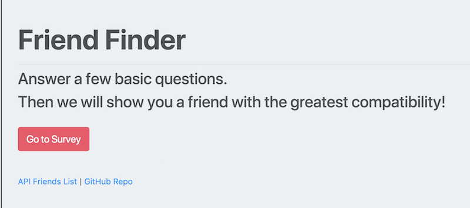
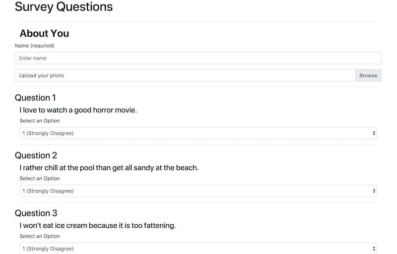
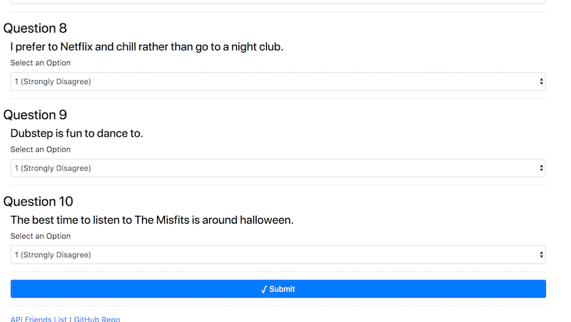
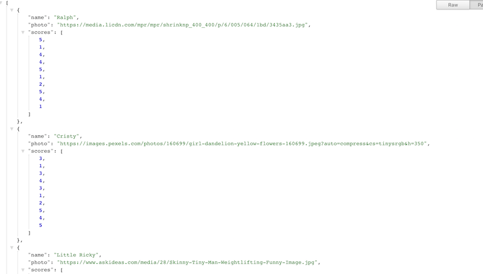

#  friendFinder: an app by Brian Madeira
## friendFinder Homework assignment

This is my friendfinder program in which a user can answer ten questions in a custom survey and my app will friend the user a new friend based on the answers they submit.

First, the user will be brought to the landing page that contains a button labeled "Go to Survey".

When this button is clicked the server will take them to the survey page. 

The user will begin by inputting their name and uploading a photo of themselves. The user will then read the ten statements and choose an answer for each question 

* Answers range from [1(strongly disagree) - 5(strongly agree)]

When the user has picked answers for all ten questions, they will hit submit. 

A modal will then display a friends name and picture of their new best friend.

The users name, picture and scores will be saved in the Api Friends List, which is linked at the bottom of both the home page and survey page.

# This app is deployed on Heroku.

## Thank you for viewing my friend finder app!